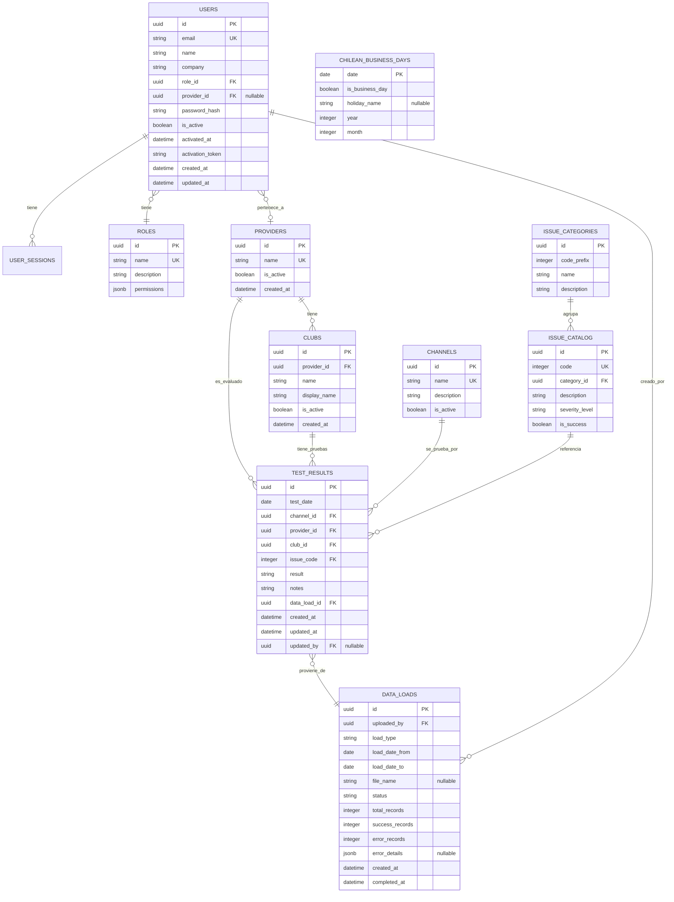

# Dashboard Gomobile WOM Chile - Lógica de Base de Datos

## 1. Modelo Relacional

El siguiente modelo relacional se deriva del archivo `2026 Database.xlsx` y de los requerimientos funcionales del sistema.

---

## 2. Diagrama Entidad-Relación



---

## 3. Definición Detallada de Tablas

### 3.1 `roles` - Roles del Sistema

```sql
CREATE TABLE roles (
    id UUID PRIMARY KEY DEFAULT gen_random_uuid(),
    name VARCHAR(50) NOT NULL UNIQUE,
    description TEXT,
    permissions JSONB NOT NULL DEFAULT '{}',
    created_at TIMESTAMP WITH TIME ZONE DEFAULT NOW()
);

-- Datos iniciales
INSERT INTO roles (name, description, permissions) VALUES
('admin', 'Equipo Gomobile - Acceso total', '{"can_upload": true, "can_edit_data": true, "can_manage_users": true, "can_view_all": true}'),
('carrier', 'Operadora WOM Chile - Solo visualización completa', '{"can_upload": false, "can_edit_data": false, "can_manage_users": false, "can_view_all": true}'),
('provider', 'Proveedor de Contenido - Visualización limitada a su data', '{"can_upload": false, "can_edit_data": false, "can_manage_users": false, "can_view_all": false}');
```

### 3.2 `providers` - Proveedores de Contenido

```sql
CREATE TABLE providers (
    id UUID PRIMARY KEY DEFAULT gen_random_uuid(),
    name VARCHAR(100) NOT NULL UNIQUE,
    is_active BOOLEAN NOT NULL DEFAULT true,
    created_at TIMESTAMP WITH TIME ZONE DEFAULT NOW(),
    updated_at TIMESTAMP WITH TIME ZONE DEFAULT NOW()
);

-- Datos iniciales (18 proveedores)
INSERT INTO providers (name) VALUES
('Opratel'), ('Chocolate'), ('Renxo'), ('Digital Virgo'), ('Bennu'),
('T-Mobs'), ('airG'), ('Zed'), ('GPM'), ('Celcom'),
('AWG'), ('Cykadas'), ('FaroMobile'), ('KMD'), ('True Caller'),
('Wasabi'), ('SocialAst'), ('Digevo');
```

### 3.3 `clubs` - Clubs/Productos por Proveedor

```sql
CREATE TABLE clubs (
    id UUID PRIMARY KEY DEFAULT gen_random_uuid(),
    provider_id UUID NOT NULL REFERENCES providers(id) ON DELETE CASCADE,
    name VARCHAR(50) NOT NULL, -- "Club 1", "Club 2", "Club 3"
    display_name VARCHAR(150) NOT NULL, -- "Opratel - Club 1"
    is_active BOOLEAN NOT NULL DEFAULT true,
    created_at TIMESTAMP WITH TIME ZONE DEFAULT NOW(),
    UNIQUE(provider_id, name)
);

-- Datos iniciales (54 clubs: 18 proveedores × 3 clubs)
-- Se generan programáticamente al inicializar el sistema
```

### 3.4 `channels` - Canales de Prueba

```sql
CREATE TABLE channels (
    id UUID PRIMARY KEY DEFAULT gen_random_uuid(),
    name VARCHAR(50) NOT NULL UNIQUE,
    description TEXT,
    is_active BOOLEAN NOT NULL DEFAULT true,
    created_at TIMESTAMP WITH TIME ZONE DEFAULT NOW()
);

-- Datos iniciales
INSERT INTO channels (name, description) VALUES
('SMS', 'Mensajes de texto'),
('SAT', 'SIM Application Toolkit'),
('Web', 'Portales web'),
('Wap', 'Portales WAP / Mobile web'),
('Sim', 'Servicios embebidos en SIM'),
('Tienda', 'Tiendas físicas del operador'),
('Otro', 'Otros canales (IVR, etc.)');
```

### 3.5 `issue_categories` - Categorías de Issues

```sql
CREATE TABLE issue_categories (
    id UUID PRIMARY KEY DEFAULT gen_random_uuid(),
    code_prefix INTEGER NOT NULL UNIQUE, -- 100, 200, 300, 400, 500, 700, 800
    name VARCHAR(100) NOT NULL,
    description TEXT,
    created_at TIMESTAMP WITH TIME ZONE DEFAULT NOW()
);

-- Datos iniciales
INSERT INTO issue_categories (code_prefix, name, description) VALUES
(100, '(100) Alta', 'Pruebas de suscripción/alta al servicio'),
(200, '(200) Contenidos', 'Pruebas de entrega de contenidos'),
(300, '(300) Cobros', 'Pruebas de cobros y facturación'),
(400, '(400) Portales / Web-App', 'Pruebas de portales y aplicaciones web'),
(500, '(500) Baja / Cancelacion', 'Pruebas de baja/cancelación del servicio'),
(700, '(700) Interaccion MO/MT (On Demand)', 'Pruebas de interacción MO/MT'),
(800, '(800) Politicas especiales operadores', 'Pruebas de cumplimiento de políticas del operador');
```

### 3.6 `issue_catalog` - Catálogo de Códigos de Falla

```sql
CREATE TABLE issue_catalog (
    id UUID PRIMARY KEY DEFAULT gen_random_uuid(),
    code INTEGER NOT NULL UNIQUE,
    category_id UUID NOT NULL REFERENCES issue_categories(id),
    description TEXT NOT NULL,
    severity_level VARCHAR(20) NOT NULL, -- 'Prueba OK', 'Critico', 'Medio', 'Bajo'
    is_success BOOLEAN NOT NULL DEFAULT false, -- true para códigos 100, 200, 300, 400, 500, 700, 800
    created_at TIMESTAMP WITH TIME ZONE DEFAULT NOW(),
    
    CONSTRAINT chk_severity CHECK (severity_level IN ('Prueba OK', 'Critico', 'Medio', 'Bajo'))
);

-- Datos iniciales (63 códigos de falla)
-- Categoría 100 - Alta
INSERT INTO issue_catalog (code, category_id, description, severity_level, is_success) VALUES
(100, (SELECT id FROM issue_categories WHERE code_prefix = 100), 'Alta con éxito.', 'Prueba OK', true),
(101, (SELECT id FROM issue_categories WHERE code_prefix = 100), 'No se genero el alta - no hay respuesta al kw.', 'Critico', false),
(102, (SELECT id FROM issue_categories WHERE code_prefix = 100), 'Falla en doble optin en sms.', 'Critico', false),
(103, (SELECT id FROM issue_categories WHERE code_prefix = 100), 'Inconsistencia en el welcome.', 'Critico', false),
(104, (SELECT id FROM issue_categories WHERE code_prefix = 100), 'No llega pin code.', 'Medio', false),
(105, (SELECT id FROM issue_categories WHERE code_prefix = 100), 'Inconsistencia en el pin code.', 'Medio', false),
(106, (SELECT id FROM issue_categories WHERE code_prefix = 100), 'Falla en lp de suscripción web.', 'Critico', false),
(107, (SELECT id FROM issue_categories WHERE code_prefix = 100), 'Falla en lp de suscripción wap - header enrichment.', 'Critico', false),
(108, (SELECT id FROM issue_categories WHERE code_prefix = 100), 'Inconsistencias en t&c en la lp.', 'Critico', false),
(109, (SELECT id FROM issue_categories WHERE code_prefix = 100), 'Fallas en estructura o diseño de la lp.', 'Medio', false),
(110, (SELECT id FROM issue_categories WHERE code_prefix = 100), 'Falla en alta a traves de ivr.', 'Critico', false),
(111, (SELECT id FROM issue_categories WHERE code_prefix = 100), 'Falla en alta a traves de sim.', 'Critico', false),
(112, (SELECT id FROM issue_categories WHERE code_prefix = 100), 'Falla en alta a traves de tienda.', 'Critico', false),
(113, (SELECT id FROM issue_categories WHERE code_prefix = 100), 'Servicio suspendido.', 'Medio', false),
(114, (SELECT id FROM issue_categories WHERE code_prefix = 100), 'Falla en doble optin en sim.', 'Critico', false);

-- Categoría 200 - Contenidos
INSERT INTO issue_catalog (code, category_id, description, severity_level, is_success) VALUES
(200, (SELECT id FROM issue_categories WHERE code_prefix = 200), 'Contenidos recibido con éxito.', 'Prueba OK', true),
(201, (SELECT id FROM issue_categories WHERE code_prefix = 200), 'Entrega de mensaje fuera de horario establecido.', 'Critico', false),
(202, (SELECT id FROM issue_categories WHERE code_prefix = 200), 'Inconsistencias en textos/fraseologia sms.', 'Medio', false),
(203, (SELECT id FROM issue_categories WHERE code_prefix = 200), 'Entrega de mensajeria sms con delay.', 'Bajo', false),
(204, (SELECT id FROM issue_categories WHERE code_prefix = 200), 'Error/inconsistencia en t&c en sms.', 'Critico', false),
(205, (SELECT id FROM issue_categories WHERE code_prefix = 200), 'Llego contenido de otro club.', 'Critico', false),
(206, (SELECT id FROM issue_categories WHERE code_prefix = 200), 'Llego doble contenido.', 'Medio', false),
(207, (SELECT id FROM issue_categories WHERE code_prefix = 200), 'Contenido repetido.', 'Medio', false),
(208, (SELECT id FROM issue_categories WHERE code_prefix = 200), 'No cumple las politicas de estructura del operador.', 'Critico', false),
(209, (SELECT id FROM issue_categories WHERE code_prefix = 200), 'Contenido desactualizado.', 'Medio', false),
(210, (SELECT id FROM issue_categories WHERE code_prefix = 200), 'Contenido no apropiado - fuera de las politicas del operador.', 'Critico', false);

-- Categoría 300 - Cobros
INSERT INTO issue_catalog (code, category_id, description, severity_level, is_success) VALUES
(300, (SELECT id FROM issue_categories WHERE code_prefix = 300), 'Cobro en valor y forma correcto.', 'Prueba OK', true),
(301, (SELECT id FROM issue_categories WHERE code_prefix = 300), 'No llego contenido (si hubo cobro).', 'Critico', false),
(302, (SELECT id FROM issue_categories WHERE code_prefix = 300), 'No llego contenido (no hubo cobro).', 'Critico', false),
(303, (SELECT id FROM issue_categories WHERE code_prefix = 300), 'Llego contenido (no hubo cobro).', 'Critico', false),
(304, (SELECT id FROM issue_categories WHERE code_prefix = 300), 'Cobro valor diferente al autorizado.', 'Critico', false),
(305, (SELECT id FROM issue_categories WHERE code_prefix = 300), 'Cobro doble vez.', 'Critico', false),
(306, (SELECT id FROM issue_categories WHERE code_prefix = 300), 'Inconsistencias en la recurrencia del cobro.', 'Critico', false),
(307, (SELECT id FROM issue_categories WHERE code_prefix = 300), 'Inconsistencias con el cobro escalonado.', 'Critico', false),
(308, (SELECT id FROM issue_categories WHERE code_prefix = 300), 'No entrega confirmacion de cobro.', 'Critico', false);

-- Categoría 400 - Portales / Web-App
INSERT INTO issue_catalog (code, category_id, description, severity_level, is_success) VALUES
(400, (SELECT id FROM issue_categories WHERE code_prefix = 400), 'Portal evaluado con éxito.', 'Prueba OK', true),
(401, (SELECT id FROM issue_categories WHERE code_prefix = 400), 'Problemas con las credenciales y acceso a portal / web-app.', 'Critico', false),
(402, (SELECT id FROM issue_categories WHERE code_prefix = 400), 'Portal / web-app caida.', 'Critico', false),
(403, (SELECT id FROM issue_categories WHERE code_prefix = 400), 'Portal desactualizado.', 'Medio', false),
(404, (SELECT id FROM issue_categories WHERE code_prefix = 400), 'No cumple las politicas de estructura del operador.', 'Critico', false),
(405, (SELECT id FROM issue_categories WHERE code_prefix = 400), 'Problemas de estructura o textos del portal o web-app.', 'Medio', false),
(406, (SELECT id FROM issue_categories WHERE code_prefix = 400), 'No descarga contenidos - problemas con la descarga.', 'Critico', false),
(407, (SELECT id FROM issue_categories WHERE code_prefix = 400), 'No funciona la interaccion.', 'Critico', false),
(408, (SELECT id FROM issue_categories WHERE code_prefix = 400), 'Inconsistencias en los t&c del portal / web-app.', 'Critico', false),
(409, (SELECT id FROM issue_categories WHERE code_prefix = 400), 'No cumple con caracteristicas de diseño responsive.', 'Critico', false);

-- Categoría 500 - Baja / Cancelación
INSERT INTO issue_catalog (code, category_id, description, severity_level, is_success) VALUES
(500, (SELECT id FROM issue_categories WHERE code_prefix = 500), 'Baja con éxito.', 'Prueba OK', true),
(501, (SELECT id FROM issue_categories WHERE code_prefix = 500), 'No funciona el comando de baja.', 'Critico', false),
(502, (SELECT id FROM issue_categories WHERE code_prefix = 500), 'No entrega el mt de baja.', 'Critico', false),
(503, (SELECT id FROM issue_categories WHERE code_prefix = 500), 'Dio de baja en sms pero sigue activo en la plataforma.', 'Critico', false),
(504, (SELECT id FROM issue_categories WHERE code_prefix = 500), 'No funciona la baja desde la lp.', 'Critico', false),
(505, (SELECT id FROM issue_categories WHERE code_prefix = 500), 'No funciona la baja desde tienda.', 'Critico', false),
(506, (SELECT id FROM issue_categories WHERE code_prefix = 500), 'No funciona la baja desde ivr.', 'Critico', false),
(507, (SELECT id FROM issue_categories WHERE code_prefix = 500), 'No funciona la baja desde portal / web app.', 'Critico', false),
(508, (SELECT id FROM issue_categories WHERE code_prefix = 500), 'No permite dar baja por no tener saldo.', 'Critico', false);

-- Categoría 700 - Interacción MO/MT
INSERT INTO issue_catalog (code, category_id, description, severity_level, is_success) VALUES
(700, (SELECT id FROM issue_categories WHERE code_prefix = 700), 'Flujo MO/MT con éxito.', 'Prueba OK', true),
(701, (SELECT id FROM issue_categories WHERE code_prefix = 700), 'No envia el mo.', 'Critico', false),
(702, (SELECT id FROM issue_categories WHERE code_prefix = 700), 'No se recibe mt.', 'Critico', false),
(703, (SELECT id FROM issue_categories WHERE code_prefix = 700), 'Fallas en la interaccion mo/mt.', 'Critico', false),
(704, (SELECT id FROM issue_categories WHERE code_prefix = 700), 'Fallas en puntajes, trivias, creditos, etc.', 'Critico', false),
(705, (SELECT id FROM issue_categories WHERE code_prefix = 700), 'No funcionan los kw´s especiales (info, puntaje, ayuda, etc).', 'Medio', false);

-- Categoría 800 - Políticas especiales
INSERT INTO issue_catalog (code, category_id, description, severity_level, is_success) VALUES
(800, (SELECT id FROM issue_categories WHERE code_prefix = 800), 'Politicas de los operadores cumplidas.', 'Prueba OK', true),
(801, (SELECT id FROM issue_categories WHERE code_prefix = 800), 'No da respuesta a kw regulatorio.', 'Critico', false),
(802, (SELECT id FROM issue_categories WHERE code_prefix = 800), 'Falla en colilla legal con info del cp.', 'Critico', false);
```

### 3.7 `users` - Usuarios del Sistema

```sql
CREATE TABLE users (
    id UUID PRIMARY KEY DEFAULT gen_random_uuid(),
    email VARCHAR(255) NOT NULL UNIQUE,
    name VARCHAR(200) NOT NULL,
    company VARCHAR(200),
    role_id UUID NOT NULL REFERENCES roles(id),
    provider_id UUID REFERENCES providers(id), -- Solo para rol 'provider'
    password_hash VARCHAR(255),
    is_active BOOLEAN NOT NULL DEFAULT false,
    activation_token VARCHAR(255),
    activation_token_expires TIMESTAMP WITH TIME ZONE,
    activated_at TIMESTAMP WITH TIME ZONE,
    last_login TIMESTAMP WITH TIME ZONE,
    created_at TIMESTAMP WITH TIME ZONE DEFAULT NOW(),
    updated_at TIMESTAMP WITH TIME ZONE DEFAULT NOW(),
    
    CONSTRAINT chk_provider_role CHECK (
        (role_id = (SELECT id FROM roles WHERE name = 'provider') AND provider_id IS NOT NULL)
        OR (role_id != (SELECT id FROM roles WHERE name = 'provider') AND provider_id IS NULL)
    )
);

CREATE INDEX idx_users_email ON users(email);
CREATE INDEX idx_users_role ON users(role_id);
CREATE INDEX idx_users_provider ON users(provider_id);
```

### 3.8 `data_loads` - Registro de Cargas de Datos

```sql
CREATE TABLE data_loads (
    id UUID PRIMARY KEY DEFAULT gen_random_uuid(),
    uploaded_by UUID NOT NULL REFERENCES users(id),
    load_type VARCHAR(20) NOT NULL, -- 'excel', 'form'
    load_date_from DATE NOT NULL,
    load_date_to DATE NOT NULL,
    file_name VARCHAR(500), -- Nombre original del archivo (solo para tipo 'excel')
    status VARCHAR(20) NOT NULL DEFAULT 'pending', -- 'pending', 'processing', 'completed', 'error', 'partial'
    total_records INTEGER DEFAULT 0,
    success_records INTEGER DEFAULT 0,
    error_records INTEGER DEFAULT 0,
    error_details JSONB, -- Detalle de errores por registro
    created_at TIMESTAMP WITH TIME ZONE DEFAULT NOW(),
    completed_at TIMESTAMP WITH TIME ZONE,
    
    CONSTRAINT chk_load_type CHECK (load_type IN ('excel', 'form')),
    CONSTRAINT chk_status CHECK (status IN ('pending', 'processing', 'completed', 'error', 'partial')),
    CONSTRAINT chk_dates CHECK (load_date_from <= load_date_to),
    CONSTRAINT chk_no_future CHECK (load_date_to <= CURRENT_DATE)
);

CREATE INDEX idx_data_loads_dates ON data_loads(load_date_from, load_date_to);
CREATE INDEX idx_data_loads_status ON data_loads(status);
```

### 3.9 `test_results` - Resultados de Pruebas (Tabla Principal)

```sql
CREATE TABLE test_results (
    id UUID PRIMARY KEY DEFAULT gen_random_uuid(),
    test_date DATE NOT NULL,
    channel_id UUID NOT NULL REFERENCES channels(id),
    provider_id UUID NOT NULL REFERENCES providers(id),
    club_id UUID NOT NULL REFERENCES clubs(id),
    issue_code INTEGER NOT NULL REFERENCES issue_catalog(code),
    result VARCHAR(10) NOT NULL, -- 'OK' o 'Issue'
    notes TEXT, -- Notas adicionales opcionales
    data_load_id UUID REFERENCES data_loads(id),
    created_at TIMESTAMP WITH TIME ZONE DEFAULT NOW(),
    updated_at TIMESTAMP WITH TIME ZONE DEFAULT NOW(),
    updated_by UUID REFERENCES users(id),
    
    CONSTRAINT chk_result CHECK (result IN ('OK', 'Issue')),
    CONSTRAINT chk_no_future_test CHECK (test_date <= CURRENT_DATE)
);

CREATE INDEX idx_test_results_date ON test_results(test_date);
CREATE INDEX idx_test_results_provider ON test_results(provider_id);
CREATE INDEX idx_test_results_club ON test_results(club_id);
CREATE INDEX idx_test_results_issue ON test_results(issue_code);
CREATE INDEX idx_test_results_result ON test_results(result);
CREATE INDEX idx_test_results_data_load ON test_results(data_load_id);
CREATE INDEX idx_test_results_date_provider ON test_results(test_date, provider_id);
```

### 3.10 `chilean_business_days` - Calendario Laboral de Chile

```sql
CREATE TABLE chilean_business_days (
    date DATE PRIMARY KEY,
    is_business_day BOOLEAN NOT NULL DEFAULT true,
    holiday_name VARCHAR(200),
    year INTEGER NOT NULL,
    month INTEGER NOT NULL
);

CREATE INDEX idx_business_days_year_month ON chilean_business_days(year, month);
CREATE INDEX idx_business_days_is_business ON chilean_business_days(is_business_day);
```

---

## 4. Lógica de Mapeo Excel → Base de Datos

### 4.1 Mapeo de Columnas del Excel a Tablas

| Columna Excel | Tabla BD | Campo BD | Lógica de Mapeo |
|---------------|----------|----------|-----------------|
| Fecha | test_results | test_date | Directo (formato date) |
| Mes | — | — | Se calcula desde test_date (no se almacena) |
| Año | — | — | Se calcula desde test_date (no se almacena) |
| Canal | channels → test_results | channel_id | Lookup por name en tabla channels |
| Proveedor | providers → test_results | provider_id | Lookup por name en tabla providers |
| Club | clubs → test_results | club_id | Lookup por display_name en tabla clubs |
| ISSUE | issue_catalog → test_results | issue_code | Directo (código numérico) |
| Categoria | — | — | Se resuelve desde issue_catalog.category_id (no se almacena) |
| DESCRIPCION | — | — | Se resuelve desde issue_catalog.description (no se almacena) |
| Nivel | — | — | Se resuelve desde issue_catalog.severity_level (no se almacena) |
| Resultado | test_results | result | Directo ('OK' o 'Issue') |

### 4.2 Regla de Derivación del Resultado

```
SI issue_catalog.is_success = true → result = 'OK'
SI issue_catalog.is_success = false → result = 'Issue'
```

La columna `result` se almacena redundantemente para facilitar consultas rápidas, pero su valor se valida contra el catálogo de issues al momento de la ingesta.

### 4.3 Proceso de Ingesta desde Excel

```
1. Usuario selecciona fecha(s) de carga
2. Usuario sube archivo(s) Excel/CSV
3. Sistema crea registro en data_loads (status = 'processing')
4. Por cada fila del archivo:
   a. Validar que test_date corresponde al archivo correcto
   b. Buscar channel_id por nombre de canal
   c. Buscar provider_id por nombre de proveedor
   d. Buscar club_id por nombre de club (y validar que pertenece al proveedor)
   e. Validar que issue_code existe en issue_catalog
   f. Derivar result según is_success del issue_code
   g. Insertar en test_results
5. Actualizar data_loads con conteos y status final
```

### 4.4 Validaciones de Ingesta

| Validación | Regla | Acción si falla |
|------------|-------|-----------------|
| Fecha futura | test_date <= CURRENT_DATE | Rechazar registro |
| Canal válido | Canal existe en tabla channels | Rechazar registro |
| Proveedor válido | Proveedor existe en tabla providers | Rechazar registro |
| Club válido | Club existe y pertenece al proveedor | Rechazar registro |
| Issue válido | Código existe en issue_catalog | Rechazar registro |
| Consistencia resultado | result coincide con is_success del issue | Corregir automáticamente |
| Día laboral | test_date es día laboral en Chile | Advertencia (no bloquea) |

---

## 5. Queries para KPIs del Dashboard

### 5.1 Home - Resumen General

```sql
-- Total proveedores activos y sus clubs
SELECT 
    p.name AS provider_name,
    COUNT(c.id) AS total_clubs
FROM providers p
JOIN clubs c ON c.provider_id = p.id
WHERE p.is_active = true AND c.is_active = true
GROUP BY p.name
ORDER BY p.name;
```

### 5.2 Pruebas Exitosas vs Issues (por período)

```sql
-- Equivalente a tabla dinámica "Pruebas Exitosas Vs Issues"
SELECT 
    result,
    COUNT(*) AS count
FROM test_results
WHERE test_date BETWEEN :start_date AND :end_date
GROUP BY result;
```

### 5.3 Issues por Categoría

```sql
-- Equivalente a tabla dinámica por categoría OK/Issue
SELECT 
    ic2.name AS category_name,
    tr.result,
    COUNT(*) AS count
FROM test_results tr
JOIN issue_catalog ic ON ic.code = tr.issue_code
JOIN issue_categories ic2 ON ic2.id = ic.category_id
WHERE tr.test_date BETWEEN :start_date AND :end_date
GROUP BY ic2.name, tr.result
ORDER BY ic2.code_prefix;
```

### 5.4 Detalle de Issues por Descripción

```sql
-- Equivalente a tabla dinámica detallada por tipo de falla
SELECT 
    ic.description,
    ic.severity_level,
    COUNT(*) AS count
FROM test_results tr
JOIN issue_catalog ic ON ic.code = tr.issue_code
WHERE tr.result = 'Issue'
    AND tr.test_date BETWEEN :start_date AND :end_date
GROUP BY ic.description, ic.severity_level
ORDER BY count DESC;
```

### 5.5 Tendencia Mensual por Criticidad

```sql
-- Equivalente a tabla dinámica mensual de criticidad
SELECT 
    EXTRACT(YEAR FROM tr.test_date) AS year,
    EXTRACT(MONTH FROM tr.test_date) AS month,
    ic.severity_level,
    COUNT(*) AS count
FROM test_results tr
JOIN issue_catalog ic ON ic.code = tr.issue_code
WHERE tr.result = 'Issue'
    AND tr.test_date BETWEEN :start_date AND :end_date
GROUP BY year, month, ic.severity_level
ORDER BY year, month;
```

### 5.6 Issues por Proveedor y Categoría

```sql
-- Equivalente a tabla dinámica por proveedor
SELECT 
    p.name AS provider_name,
    ic2.name AS category_name,
    tr.result,
    COUNT(*) AS count
FROM test_results tr
JOIN providers p ON p.id = tr.provider_id
JOIN issue_catalog ic ON ic.code = tr.issue_code
JOIN issue_categories ic2 ON ic2.id = ic.category_id
WHERE tr.test_date BETWEEN :start_date AND :end_date
    AND (:provider_id IS NULL OR tr.provider_id = :provider_id)
GROUP BY p.name, ic2.name, tr.result
ORDER BY p.name, ic2.code_prefix;
```

### 5.7 Estado de Carga de Días

```sql
-- Vista de estado de carga por día (admin)
SELECT 
    cbd.date,
    cbd.is_business_day,
    cbd.holiday_name,
    CASE 
        WHEN NOT cbd.is_business_day THEN 'no_aplica'
        WHEN dl.id IS NOT NULL AND dl.status = 'completed' THEN 'cargado'
        WHEN dl.id IS NOT NULL AND dl.status = 'error' THEN 'error'
        WHEN dl.id IS NOT NULL AND dl.status = 'partial' THEN 'parcial'
        ELSE 'pendiente'
    END AS load_status,
    COALESCE(counts.total, 0) AS records_count
FROM chilean_business_days cbd
LEFT JOIN LATERAL (
    SELECT DISTINCT dl.*
    FROM data_loads dl
    WHERE cbd.date BETWEEN dl.load_date_from AND dl.load_date_to
        AND dl.status IN ('completed', 'partial', 'error')
    LIMIT 1
) dl ON true
LEFT JOIN LATERAL (
    SELECT COUNT(*) AS total
    FROM test_results tr
    WHERE tr.test_date = cbd.date
) counts ON true
WHERE cbd.date BETWEEN :start_date AND :end_date
ORDER BY cbd.date;
```

---

## 6. Lógica de Filtrado por Rol

### 6.1 Filtro para Rol Provider

```sql
-- Todas las consultas de datos para usuarios con rol 'provider' 
-- deben incluir este filtro:
WHERE tr.provider_id = :user_provider_id
```

### 6.2 Middleware de Acceso

```
IF user.role = 'admin':
    → Sin filtros de datos. Acceso a todas las secciones.
IF user.role = 'carrier':
    → Sin filtros de datos. Sin acceso a secciones administrativas.
IF user.role = 'provider':
    → Filtro obligatorio: provider_id = user.provider_id
    → Sin acceso a secciones administrativas.
```

---

## 7. Formato Esperado del Archivo Excel para Carga

### 7.1 Nombre del Archivo
```
Formato: YYYY-MM-DD_pruebas_VAS.xlsx
Ejemplo: 2026-06-15_pruebas_VAS.xlsx
```

### 7.2 Estructura Esperada (Columnas)

| Posición | Nombre Columna | Tipo | Obligatorio | Validación |
|----------|---------------|------|-------------|------------|
| A | Fecha | Date | Sí | Debe coincidir con la fecha del archivo |
| B | Canal | String | Sí | Debe existir en catálogo de canales |
| C | Proveedor | String | Sí | Debe existir en catálogo de proveedores |
| D | Club | String | Sí | Debe existir y pertenecer al proveedor |
| E | ISSUE | Integer | Sí | Debe existir en catálogo de issues |

**Nota:** Las columnas Mes, Año, Categoría, Descripción, Nivel y Resultado se derivan automáticamente del código de issue y la fecha. No es obligatorio que vengan en el archivo.

---

## 8. Índices y Optimización

```sql
-- Índices compuestos para las consultas más frecuentes del dashboard
CREATE INDEX idx_test_results_date_result ON test_results(test_date, result);
CREATE INDEX idx_test_results_provider_date ON test_results(provider_id, test_date);
CREATE INDEX idx_test_results_issue_date ON test_results(issue_code, test_date);

-- Vista materializada para KPIs mensuales (opcional, para performance)
CREATE MATERIALIZED VIEW mv_monthly_summary AS
SELECT 
    DATE_TRUNC('month', tr.test_date) AS month,
    tr.provider_id,
    p.name AS provider_name,
    ic2.code_prefix AS category_code,
    ic2.name AS category_name,
    ic.severity_level,
    tr.result,
    COUNT(*) AS count
FROM test_results tr
JOIN providers p ON p.id = tr.provider_id
JOIN issue_catalog ic ON ic.code = tr.issue_code
JOIN issue_categories ic2 ON ic2.id = ic.category_id
GROUP BY month, tr.provider_id, p.name, ic2.code_prefix, ic2.name, ic.severity_level, tr.result;

CREATE INDEX idx_mv_monthly_month ON mv_monthly_summary(month);
CREATE INDEX idx_mv_monthly_provider ON mv_monthly_summary(provider_id);
```

---

## 9. Feriados de Chile 2025-2026 (Para Calendario Laboral)

```sql
-- Feriados Chile 2026
INSERT INTO chilean_business_days (date, is_business_day, holiday_name, year, month)
VALUES
('2026-01-01', false, 'Año Nuevo', 2026, 1),
('2026-04-03', false, 'Viernes Santo', 2026, 4),
('2026-04-04', false, 'Sábado Santo', 2026, 4),
('2026-05-01', false, 'Día del Trabajo', 2026, 5),
('2026-05-21', false, 'Día de las Glorias Navales', 2026, 5),
('2026-06-20', false, 'Día Nacional de los Pueblos Indígenas', 2026, 6),
('2026-06-29', false, 'San Pedro y San Pablo', 2026, 6),
('2026-07-16', false, 'Virgen del Carmen', 2026, 7),
('2026-08-15', false, 'Asunción de la Virgen', 2026, 8),
('2026-09-18', false, 'Fiestas Patrias', 2026, 9),
('2026-09-19', false, 'Día de las Glorias del Ejército', 2026, 9),
('2026-10-12', false, 'Encuentro de Dos Mundos', 2026, 10),
('2026-10-31', false, 'Día de las Iglesias Evangélicas', 2026, 10),
('2026-11-01', false, 'Día de Todos los Santos', 2026, 11),
('2026-12-08', false, 'Inmaculada Concepción', 2026, 12),
('2026-12-25', false, 'Navidad', 2026, 12);

-- Generar todos los días del año y marcar fines de semana
-- (Script de inicialización)
INSERT INTO chilean_business_days (date, is_business_day, year, month)
SELECT 
    d::date,
    EXTRACT(DOW FROM d) NOT IN (0, 6), -- 0=domingo, 6=sábado
    EXTRACT(YEAR FROM d)::int,
    EXTRACT(MONTH FROM d)::int
FROM generate_series('2025-01-01'::date, '2027-12-31'::date, '1 day'::interval) d
ON CONFLICT (date) DO NOTHING;
```
